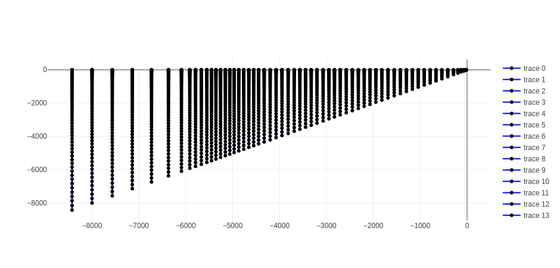
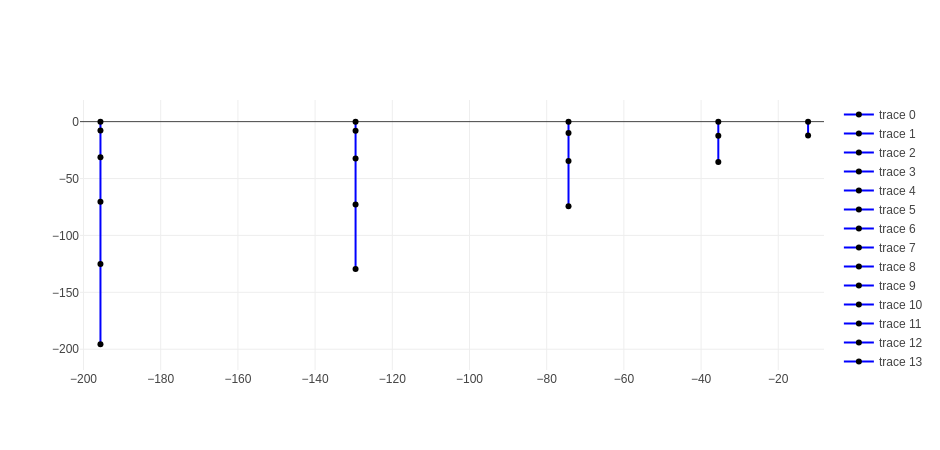

# schismrs-vgrid

## TL;DR

There are 2 binaries provided:

- gen_sz
- gen_vqs

Use the --help flag to get more info for each command.

Use the --release flag for 10x speedups.

### gen_sz

This one is the simplest and most straightforward, used to build SZ grids.

Example usage for gen_sz:

```bash
cargo run --release --bin gen_sz -- /path/to/hgrid /path/to/vgrid.in.out --slevels=10
```

### gen_vqs

Currently, there are 2 transforms supported: quadratic and s.

Example usage for gen_vqs:

```bash
cargo run --release --bin gen_vqs -- /path/to/hgrid /path/to/output/vgrid.in --transform s --dz-bottom-min=1. --a-vqs0=-0.3 --theta-b=0. --theta-f=3. hsm --depths 50.0 60.0 80.0 110.0 150.0 200.0 260.0 330.0 410.0 500.0 600.0 8426.0 --nlevels 21 22 23 24 25 26 27 28 29 30 31 32
```

The line above will run it in `hsm` mode, where you explicitly pass the HSM and levels array.

However, you can use the `auto` mode instead, which will use k-means clustering to derive and build the master grids, based on the number of clusters.
This feature in still being tested and is provided here as a proof of concept.

**Hint** You can show a plot of your z_mas configuration by using --show-zmas-plot

```bash
cargo run --release --bin gen_vqs -- /path/to/hgrid /path/to/output/vgrid.in --transform s --dz-bottom-min=1. --a-vqs0=-0.3 --theta-b=0. --theta-f=3. auto --help
```

#### Examples of master grid outputs using kmeans clustering.

Below an example output of a 60-cluster kmeans-derived master grids.


Zooming in on the shallow nodes, we can see that the number of vertical levels is kept reasonable, which translates into computational economy for shallow nodes.


### License

`SPDX-License-Identifier: LicenseRef-schismrs-license`
