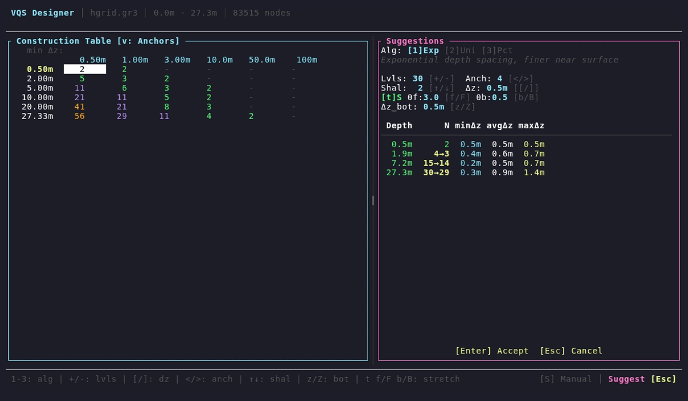

# schismrs-vgrid

Vertical grid generation for SCHISM ocean model, featuring an interactive TUI designer.

## VQS Designer

The star of this crate is **vqs-designer** - an interactive terminal application for designing VQS (Variable Quadratic/S-coordinate) master grids.


```bash
cargo run --release --bin vqs-designer -- -g /path/to/hgrid.gr3
```

### Features

**Two Synchronized Views** (toggle with `v`):
- **Table View**: Traditional construction table (depths × min Δz) for visual cell selection
- **Anchor View**: Direct editing of (depth, N) pairs for precise control

 

**Mesh-Aware Suggestions** (press `S`):
- Exponential, Uniform, and Percentile algorithms
- Analyzes your mesh's depth distribution
- Real-time preview with Δz statistics

**Real-Time Feedback**:
- Layer thickness statistics (min/avg/max Δz) per anchor
- Bottom truncation preview based on `dz_bottom_min`
- Stretching parameter adjustment (θf, θb, a_vqs0)

**Export**:
- Generate `vgrid.in` directly (requires mesh with `-g` flag)
- Overwrite confirmation for safety

### Keyboard Controls

| Key | Action |
|-----|--------|
| `v` | Toggle Table/Anchor view |
| `S` | Enter suggestion mode |
| `Space/Enter` | Select cell (Table) / Edit anchor (Anchor) |
| `a/A` | Add depth row / Δz column (Table) or Add anchor (Anchor) |
| `d` | Delete row/column (Table) or Delete anchor (Anchor) |
| `e/E` | Export modal |
| `s/q` | Toggle S-transform / Quadratic stretching |
| `f/F` | Adjust θf (±0.5) |
| `b/B` | Adjust θb (±0.1) |
| `z/Z` | Adjust dz_bottom_min (±0.1) |
| `{/}` | Resize panels |
| `?` | Help overlay |
| `Esc/q` | Quit |

### Example Workflow

1. Load your mesh: `vqs-designer -g mesh.gr3`
2. Press `S` to enter suggestion mode
3. Adjust parameters (target levels, min Δz, number of anchors)
4. Press `Enter` to accept suggestions
5. Fine-tune in Table or Anchor view
6. Press `e` to export `vgrid.in`

---

## Other Binaries

| Binary | Purpose |
|--------|---------|
| `gen_sz` | Generate SZ (sigma-z) vertical grids |
| `gen_vqs` | Generate VQS grids from CLI arguments |
| `vqs-designer` | Interactive TUI for designing VQS master grids |

## gen_sz

Generate sigma-z coordinate grids with configurable stretching.

```bash
cargo run --release --bin gen_sz -- /path/to/hgrid.gr3 \
    --slevels=20 \
    --theta-f=5 \
    --theta-b=0.7 \
    --critical-depth=5. \
    --show-plot \
    -o vgrid.in
```


## gen_vqs

Generate VQS grids using CLI arguments (for scripting/automation).

```bash
cargo run --release --bin gen_vqs -- /path/to/hgrid.gr3 \
    --transform s \
    --dz-bottom-min=1. \
    --a-vqs0=-0.3 \
    --theta-b=0. \
    --theta-f=3. \
    -o vgrid.in \
    hsm --depths 50 100 200 500 1000 \
        --nlevels 10 15 20 25 30
```

### Parameters

| Parameter | Description |
|-----------|-------------|
| `--transform` | Stretching function: `s` (S-transform) or `quadratic` |
| `--theta-f` | Surface/bottom focusing intensity (0.1-20) |
| `--theta-b` | Bottom layer focusing weight (0-1) |
| `--a-vqs0` | Stretching amplitude (-1 to 1) |
| `--dz-bottom-min` | Minimum bottom layer thickness |

---

## Compilation

This crate depends on libproj. Use conda to provide dependencies:

```bash
conda create -n schismrs
conda activate schismrs
conda install -c conda-forge compilers clang libclang proj

PROJ_SYS_STATIC=1 \
LD_LIBRARY_PATH=$CONDA_PREFIX/lib:$LD_LIBRARY_PATH \
PKG_CONFIG_PATH=$CONDA_PREFIX/lib/pkgconfig:$PKG_CONFIG_PATH \
cargo build --release
```

## License

`SPDX-License-Identifier: LicenseRef-schismrs-license`
