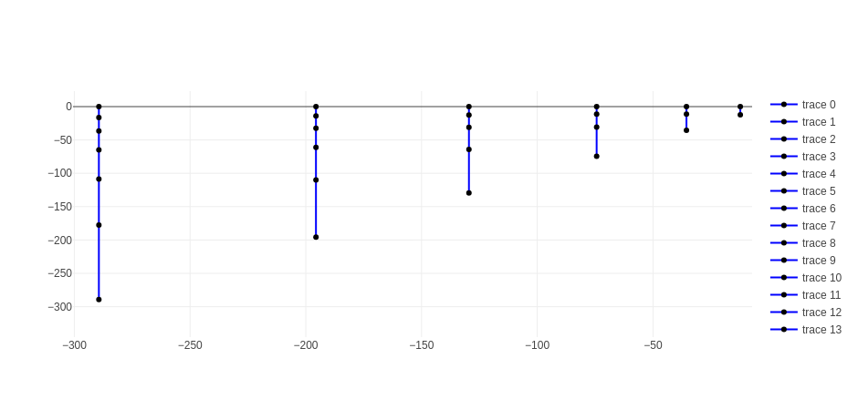

# schismrs-vgrid

## TL;DR

There are 2 binaries provided:

- gen_sz
- gen_vqs

Use the --help flag to get more info for each command.

Use the --release flag for 10x speedups.

### gen_sz

This one is the simplest and most straightforward, used to build SZ grids.

Example usage for gen_sz:

```bash
cargo run --release --bin gen_sz -- /path/to/hgrid --show-plot --slevels=20 --theta-f=5 --theta-b=0.7 --critical-depth=5. -o vgrid.in
```

The command above should show the following plot:

Naturally, the depth levels shown will depend on your input hgrid, but the vertical node distribution should be the same regardless.

### gen_vqs

Currently, there are 2 transforms supported: quadratic and s.

Example usage for gen_vqs:

There are three modes in which gen_vqs can be used:

- hsm: explicitly pass master grid depts and levels
- kmeans: Uses kmeans clustering to derive an hsm array
- auto: Uses an exponential function to build master grids

#### hsm mode

```bash
cargo run --release --bin gen_vqs -- /path/to/hgrid -o /path/to/output/vgrid.in --show-zmas-plot --transform s --dz-bottom-min=1. --a-vqs0=-0.3 --theta-b=0. --theta-f=3. hsm --depths 50.0 60.0 80.0 110.0 150.0 200.0 260.0 330.0 410.0 500.0 600.0 8426.0 --nlevels 21 22 23 24 25 26 27 28 29 30 31 32
```

#### kmeans mode

```bash
cargo run --release --bin gen_vqs -- /path/to/hgrid -o /path/to/output/vgrid.in --transform s --dz-bottom-min=1. --a-vqs0=-0.3 --theta-b=0. --theta-f=3. kmeans --clusters=60 --max-levels=49
```

Below an example output of a 60-cluster kmeans-derived master grids using quadratic transform.


Zooming in on the shallow nodes, we can see that the number of vertical levels is kept reasonable, which translates into computational economy for shallow nodes.


Same as above, but using S-transform instead.



Notes on kmeans clustering:

To me, the kmeans clustering technique looks very promising. Notice that the first level does not start close to 1, but actually it is closer to 6, which I think is good, because perhaps we don't need that much vertical resolution on the shallow nodes, at least for large-mesh, cross-scale processes. On the other hand, increasing the number of clusters will yield shallower values. Keep in mind that the number of master grids doesn't actually change the number of final grids, since those are a function of the node counts. Master grids are just templates!

#### auto mode (recommended)

```bash
cargo run --release --bin gen_vqs -- /path/to/hgrid -o /path/to/output/vgrid.in --transform s --dz-bottom-min=1. --a-vqs0=-0.3 --theta-b=0.7 --theta-f=10. auto --ngrids=40 --max-levels=49
```


It's nice to be able to see the master grid plots in real-time, isn't? =)

### TODO:

Piecewise everything, but that may be an overkill, we'll see.

### License

`SPDX-License-Identifier: LicenseRef-schismrs-license`
